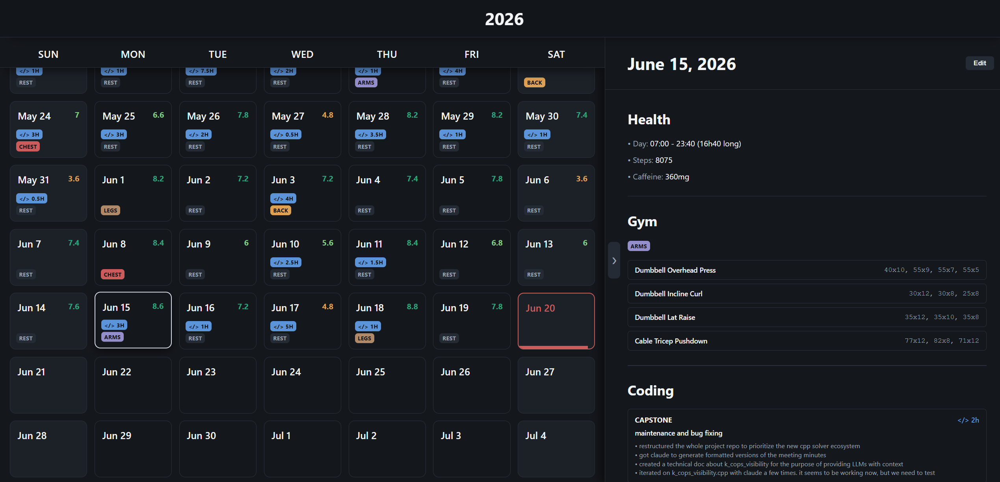

### 🔒 Showcase Snapshot – this is a source-only mirror, not a runnable build

---

# LifeOS

LifeOS is a local-first **quantified-self engine** I built to answer one stubborn question: where does my time and money actually go? Instead of asking me to log that by hand, it captures the exhaust my computer already produces — keystrokes, window focus, clicks, bank exports, health data, streaming history — normalizes all of it, and lets me query my own life like a database.

It runs entirely on `localhost`. Nothing is ever sent anywhere. It is built from a small, deliberate stack — a Win32 message hook in C++, a handful of Python services, raw SQLite, and a **zero-dependency vanilla-JS frontend** — with no web frameworks, no ORMs, and no cloud anything. Every layer is something I wanted to understand from the ground up, so I wrote it myself.

This repository is the **public, sanitized snapshot** of that system. It is meant to be read, not run — the live databases hold years of my real financial records and other personal information, so they (and the native keystroke binary) were deliberately stripped before publishing. More on that below. 🙂

---

## Table of Contents

- [LifeOS](#lifeos)
- [Philosophy](#philosophy)
- [🔒 What Was Stripped (and Why)](#what-was-stripped)
- [System Architecture](#system-architecture)
  - [Two-Server Split](#two-server-split)
  - [The Storage Model](#storage-model)
- [Key Features](#key-features)
  - [Telemetry Capture Pipeline](#telemetry-pipeline)
  - [The Dual-Gateway SQL Channel](#dual-gateway)
  - [Zero-Dependency Frontend](#zero-dependency-frontend)
  - [Git-Worktree Deploys](#git-worktree-deploys)
- [Tech Stack](#tech-stack)
- [Project Structure](#project-structure)
- [📄 License](#license)
- [📝 Final Thoughts](#final-thoughts)

---

<h2 id="philosophy">Philosophy</h2>

The rule for this project was the same one I set for [Kiwi3D](https://github.com/lindensheehy/Kiwi3D): **understand every layer by building it myself.** No Django, no SQLAlchemy, no React, no charting library. If I wanted a feature — a reactive UI component, a cross-database query engine, a keystroke capture system — I had to figure out how it actually works and write it.

That constraint shaped everything:

- The frontend is a **hand-rolled component engine** in plain JavaScript, bundled with esbuild and nothing else.
- The data layer is **raw SQLite over a thin Python handler** — no ORM, just SQL I wrote and schemas I own.
- The telemetry layer hooks the **Win32 message pump directly** instead of leaning on a library.

It's more work, and some of it is rough around the edges. But there's no part of this system I can't explain, and that was the whole point.

---

<h2 id="what-was-stripped">🔒 What Was Stripped (and Why)</h2>

This is the single most important section for anyone auditing the repo, so I want to be upfront. **This snapshot is intentionally incomplete.** A few categories of files were removed before publishing — not because they're broken, but because they either contain sensitive data or are redundant:

- **The live data — every database and JSON record.** `telemetry.db`, `imported.db`, and the entire `owned/` journal hold years of my real keystrokes, bank transactions, and Spotify history. That's about as much PII as one folder can contain, so all of it is gone. **The schemas, readers, writers, and query logic are all here** — only the data they operate on was removed.
- **The compiled `prod/` twin.** In my live setup, `prod/` is a detached **git worktree** of the dev source (see [Git-Worktree Deploys](#git-worktree-deploys)). Publishing it would just be committing a second copy of the same code, so the snapshot ships the source only.
- **The native keystroke hook.** The C++ source (`tracking/cpp/messageHook.cpp`) and its compiled `tracking/bin/messageHook.dll` are omitted. It's a Win32 message hook — exactly the kind of binary I don't want people downloading from a portfolio repo. The Python side that loads and drives it is fully present, so you can still see how the whole pipeline fits together.

> **In short:** what's here is the *engineering* — the architecture, the schemas, the pipelines, the UI engine. What's gone is the *data* and the *redundant build artifacts*. If a folder looks emptier than you'd expect, that's the boundary doing its job.

---

<h2 id="system-architecture">System Architecture</h2>

<h3 id="two-server-split">Two-Server Split</h3>

LifeOS runs as **two cooperating Python servers**, never one. This split is the backbone of the whole thing:

- **The Database Server (`127.0.0.1:4999`)** is the *only* process allowed to touch disk. It owns the SQLite lakes and the JSON journal, validates every date and category, exposes a clean REST API, and serializes all access behind a single global `threading.Lock`. Nothing else in the system reads or writes data directly — everything goes through here.
- **The Web Server (`127.0.0.1:5000`)** serves the frontend and a thin journal API. It holds an **in-RAM `MemoryStore`** that caches several months of data at a time (oldest month evicted on overflow), and runs esbuild in watch mode so JS/CSS rebundle on save. It never opens a database — it talks to the database server over HTTP like any other client.

Keeping storage behind its own process means the lock lives in exactly one place, the data contract is enforced in exactly one place, and every other component — the web app, the telemetry processor, the import pipeline — is just a well-behaved HTTP client.

<h3 id="storage-model">The Storage Model</h3>

Not all data is equal, so it isn't stored the same way:

- **"Owned" data** (things I type by hand — journal, gym sets, daily ratings) lives in **JSON as the ground truth**, with a SQLite "shadow write" mirror (`owned_index.db`) kept alongside it purely so it's queryable. JSON wins because this is data I want to be able to read and hand-edit forever, independent of any schema.
- **"Imported" data** (bank, Apple Health, Spotify, Discord) lives in **SQLite as the source of truth**, deduplicated on a deterministic content hash via `INSERT OR IGNORE`, so re-importing the same export is a no-op.
- **"Telemetry" data** (the keystroke exhaust) lives in **SQLite as the source of truth**, normalized into `processes → sessions → focus_spans / clicks / text_inputs`.

---

<h2 id="key-features">Key Features</h2>

<h3 id="telemetry-pipeline">Telemetry Capture Pipeline</h3>

This is the part I'm proudest of, and the most involved. Capturing what I'm actually doing on my machine runs through a five-stage pipeline:

1. **C++ message hook** — a `SetWindowsHookEx` hook injected into a whitelisted app's UI thread. It reposts each intercepted Win32 message to a hidden Python listener window (offset above `WM_APP`).
2. **Python endpoint** (`endpoint.py`) — one hidden window per hooked thread. Its `wndproc` decodes each message into an event dict and buffers it, flushing **10,000-event JSON chunks** to disk to keep memory flat.
3. **The injector** (`injector.py`) — the supervisor loop. Every few seconds it enumerates open windows, matches process names against a **whitelist** (including Chromium/Electron child windows, which spawn their own threads), hooks anything new, and tears down hooks for processes that have closed.
4. **The processor** (`processor.py`) — reads the raw chunks and reconstructs **structured sessions**: focus spans from `WM_SETFOCUS`/`WM_KILLFOCUS`, click coordinates, and *reconstructed typed text* — `WM_CHAR` events are replayed into a buffer where **backspaces pop the last character** and Enter becomes a newline, so what lands on disk is the resolved text, not raw scancodes. It uses a **4 AM logical-day rollover** (a 2 AM journal entry counts as the previous day) and keeps a 10 GB rolling raw backup.
5. **The database server** merges each chunk into `telemetry.db`, which is treated as the source of truth.

> One honest note: this is, mechanically, a keylogger. It only ever runs against a whitelist of *my own* apps on *my own* machine, and the captured text never leaves it — but that's exactly why the resulting database is the first thing I stripped from this repo.

<h3 id="dual-gateway">The Dual-Gateway SQL Channel</h3>

Querying the lakes happens through two deliberately different endpoints, because "find me the days matching X" and "run arbitrary analytics across everything" are very different risk profiles:

- **`/api/query/common/<source>` — the safe index.** The client sends *only* a `FROM`/`WHERE` fragment. The server blindly prepends `SELECT date`, runs it to find the matching dates, and then rebuilds the full, rich domain JSON for exactly those days using the normal readers. You get back real records, but you can never select arbitrary columns — the shape is fixed.
- **`/api/query/custom` — the analytics sandbox.** All three databases are `ATTACH`-ed to a throwaway in-memory connection so a query can `JOIN` freely across them using `telemetry.`, `imported.`, and `owned.` prefixes. This is what answers questions like *"streaming minutes vs. gym days vs. spend, by week"* without ever physically merging the lakes on disk.

<h3 id="zero-dependency-frontend">Zero-Dependency Frontend</h3>

The whole UI is **vanilla JavaScript and CSS**, bundled with esbuild — no framework, no runtime dependencies. A few pieces I'm happy with:

- A **layered component engine** in `html_builders/`: small `primitives/` (buttons, inputs, text) compose into `components/` (rows, blocks), which compose into per-domain feature modules. It's JSX-like ergonomics with plain DOM calls underneath.
- A **`MessageBroker`** that gives modules explicit, named, point-to-point messaging instead of a tangle of direct imports — registration is strict and unknown routes throw loudly.
- A **heartbeat watcher** that pings the server every 8 seconds and drops a "SERVER OFFLINE" overlay after three missed beats, so the UI never silently lies about stale data.

<h3 id="git-worktree-deploys">Git-Worktree Deploys</h3>

`control/deploy.py` is a small Tkinter tool for promoting dev → prod, and it does it with **git worktrees** rather than copying files. `prod/` is registered as a *detached worktree* of the dev repo, so "deploying" a commit is just a `git checkout <hash>` inside `prod/`. The tool shows the commit history with the live dev and prod heads highlighted, so I always know exactly what's running. This is also *why* `prod/` isn't in this repo — it's the same git history, just checked out twice.

---

<h2 id="tech-stack">Tech Stack</h2>

LifeOS is **Windows-only** by design — it hooks the Win32 message pump and uses `pywin32` throughout.

- **Backend:** Python 3.13, Flask, raw `sqlite3` (no ORM), `pywin32`, `psutil`
- **Native:** C++ compiled with `g++` (MinGW) into a `.dll`, plus a tiny `WinMain` launcher
- **Frontend:** Vanilla JS + CSS, bundled with `esbuild`
- **Tooling:** Tkinter control panel + deploy tool, git worktrees for promotion

> ⚠️ **Note:** since the data lakes and native binary are stripped, this snapshot **will not run as-is**. It's published to be read as an architecture reference, not cloned and launched.

---

<h2 id="project-structure">Project Structure</h2>

The repo is split into three top-level concerns:

- `app/` — the application itself:
  - `backend/` — the web server, REST routes, and the in-RAM cache layer.
  - `database/` — the storage server: SQLite handlers per lake, the JSON journal handler, and the dual-gateway query engine.
  - `frontend/` — the vanilla-JS app: the `html_builders/` component engine, the `core/` runtime (cache, message broker, heartbeat), per-domain `modules/`, the calendar, and the CSS.
  - `tracking/` — the telemetry layer: the Python injector/endpoint/build scripts. *(The `cpp/` source and compiled `bin/` DLL are stripped — see [above](#what-was-stripped).)*
- `data/` — everything about getting data in and storing it:
  - `ingestion_pipeline/` — the ETL pipeline: a dispatcher that sniffs each dropped file and routes it to the right `parsers/` module (BMO, Simplii, Wealthsimple, Apple Health, Spotify, Discord).
  - `lake/` — the storage root and its Python tools (access, backup, whitelist management). *(The `.db` and JSON data itself is stripped.)*
  - `telemetry/` — the raw-chunk processor that reconstructs sessions.
- `control/` — the orchestration layer: the Tkinter control panel (`controller.py`) that starts/stops every service, the git-worktree deploy tool (`deploy.py`), and the native `launcher.cpp`/`build.bat` that boot it all invisibly.

---

<h2 id="license">📄 License</h2>

This project is licensed under the [GNU General Public License v3.0](./LICENSE).

You are free to use, modify, and distribute this software, as long as any derivative work is also shared under the same license.

SPDX-License-Identifier: GPL-3.0

I use the GPL for the same reason across all my projects: I'm glad to share my work freely, as long as it *stays* open. If this helps someone, that's great — I just want that openness to carry forward.

---

<h2 id="final-thoughts">📝 Final Thoughts</h2>

> LifeOS started as a glorified journal and turned into the most architecturally involved thing I've built — two servers, a native message hook, an ETL pipeline, a cross-database query engine, and a UI engine, all talking to each other on localhost. None of it uses a framework, and I can explain every line.
> Stripping it down for a public showcase was its own small puzzle: how do you prove the engineering is real when the data has to stay private? This README is my answer. The interesting part was never my Spotify history — it was the machine built to make sense of it, and that machine is all here.
> — **Linden Sheehy**
